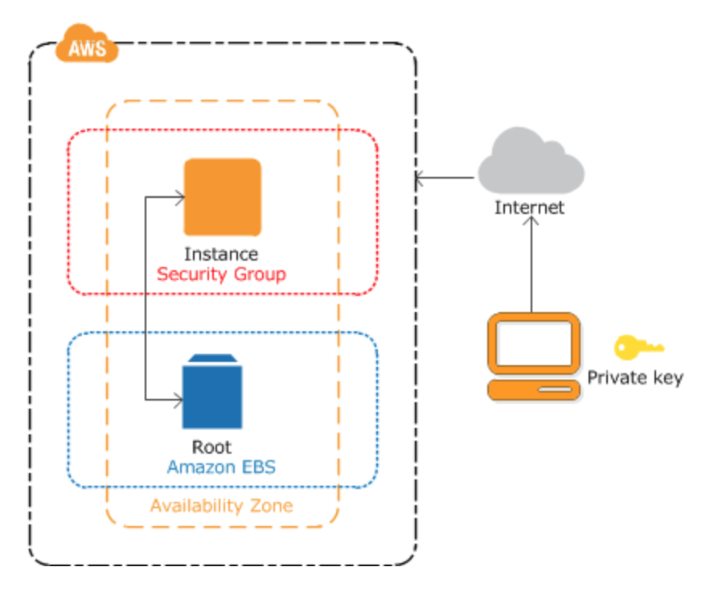
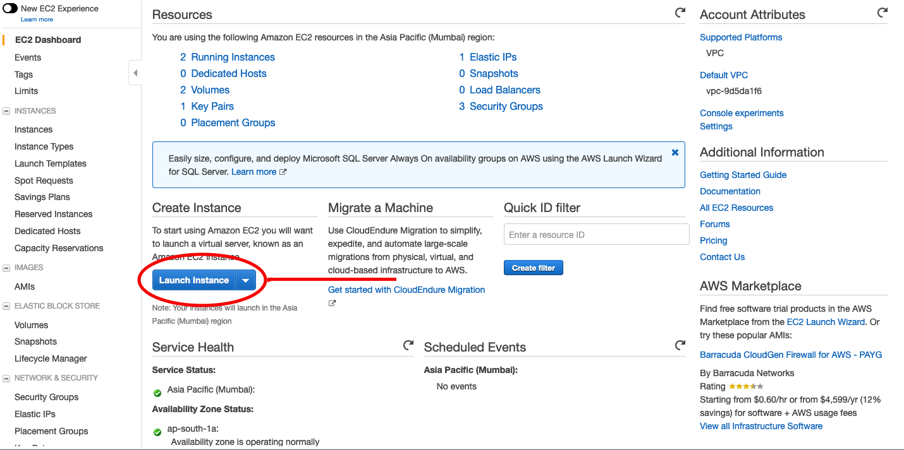
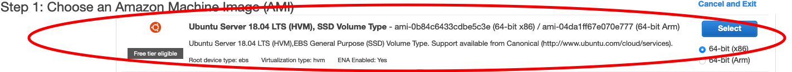
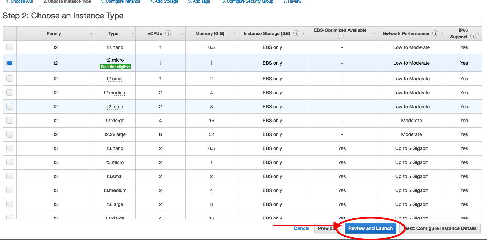
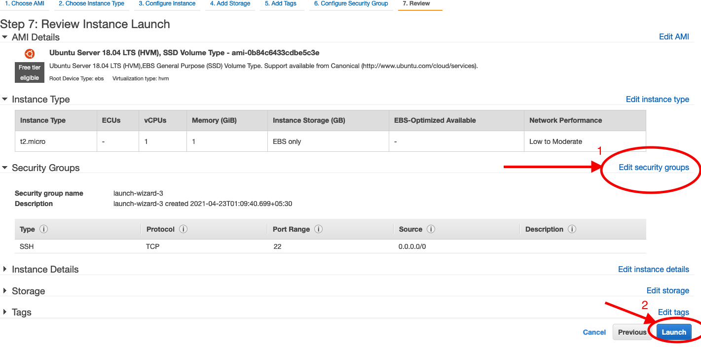
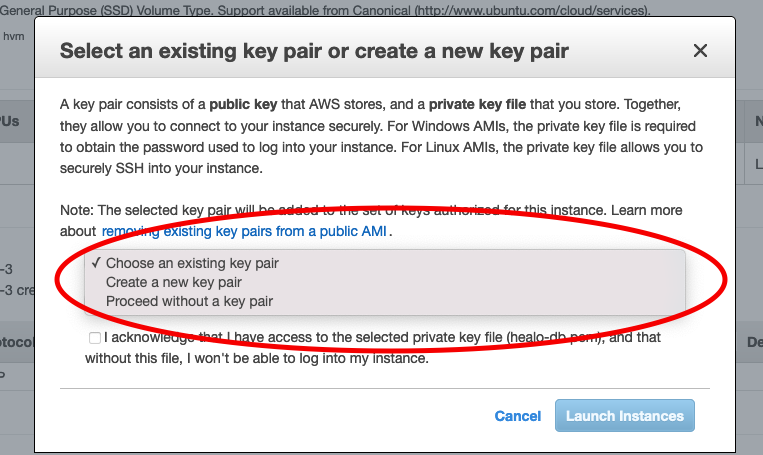

 # Learning AWS 

# AWS 

Amazon web service is a platform that offers flexible, reliable, scalable, easy-to-use and cost-effective cloud computing solutions.

## Learning Topics In AWS

### Foundation Services

* EC2(Elastic Cloud Computing)
* VPC
* S3
* EBS

### Database Services

* Amazon Dynamo DB
* Relation DB

### Management Services

* AWS Auto Scaling
* Amazon Cloud Watch
* Elastic Load Balancing

## EC2(Elastic Cloud Computing) :

With Amazon EC2 you can setup and configure the OS(operating system) and Application that run on your instance.

"An Instance is a Virtual Server in AWS Cloud."

* An Instance is an AWS EBS-backed instance (root volume is an EBS volume).

* You can either specified the Avialbility zone in which your instance run. Or amazon ser the avilability zone for you.

* When you launc your instance in AWS you secure it by specifing a key-pair and security group.

* To connect to your instance you must specify the private key that you have specified when launching your instance.

## Create An Instance :

**Step-1** - Go to the AWS console. [https://ap-south-1.console.aws.amazon.com/ec2/v2/home](https://ap-south-1.console.aws.amazon.com/ec2/v2/home)

**Step-2** - Click on Launch Instance/Launch a virtual machine with EC2.  
 
 

**Step-3** - Choose an Amazon Machine Image(AMI).
"AMI is a template that contains the Software configuration (opertaing system, application server, application). 
 
 

**Step-4** - Choose an Instance Type. In this you can configure the hardware.Click on Review and Launch to let the wizard complete the other configuration for you. 
 
   

**Step-5** - After clicking on "Review and Launch" there you can see the the details of AMI, Instance Type, Security Group, Instance Details, Storage, and Tags. You can edit that according to your preference. 

**You can see under the Security Group wizard select group for you. You can edit the Security Group by clicking the edit security button on right side .

**Step-6** - Configure security group you can add rule.

**Step-7** - Click on Launch.(to launch your Instance). 
 
 

**Step-8** - You get prompt for key-pair, select a "Create a new key pair" or if you have existing one you can choose "choose an existing key pair". After this selct the aknowledge checkbox and proceed by clicking on Launch Instance.
 
 

**Step-9** - After all the steup you get the confirmation page. Click on View Instance. On Instance screen you can check the status of the Instance.